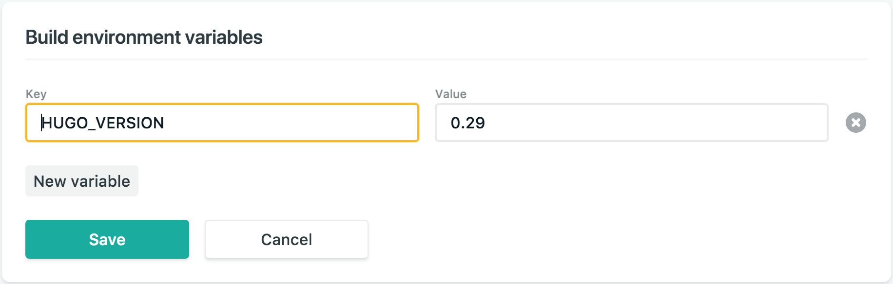
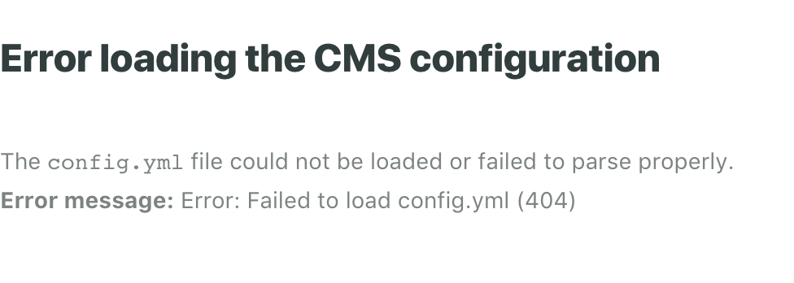

# Thomas Phillips 100 Days Of Code - Log
### Day 79: December 11, 2017
#### Hugo/ Netlify Blog

**Today's Progress**
- Got a working draft of Park Players v2 up today.
- [Add Netlify CMS to Your Site](https://www.netlifycms.org/docs/add-to-your-site/)

**Thoughts**
This site isn't as pretty as the first one, but it's waaaayy more functional, and extensible. Added CMS login to the website. People can create accounts and view the admin page. The admin page displays and I'm able to create accounts and log in. Next step is to be able to add content through the CMS.


**Link to work**
- [park-players-beta.netlify.com](https://park-players-beta.netlify.com)
- [admin site](https://park-players-beta.netlify.com/admin)
**********
**********

### Day 78: December 10, 2017
#### Getting Started with the Python Search API

**Today's Progress**
- [Installing an Example Search API Application](https://cloud.google.com/appengine/training/fts_intro/lesson1)

**Thoughts**
Spent some time reading about Google Cloud Platform. I get it better than last time I looked at it, because I've been working with AWS and Netlify. After a while, I decided I was wasting my time, and went back to working with Netlify. Well...not wasting my time, but I could better direct my energy to one of the platforms I'm already working with.

**********
**********

### Day 77: December 9, 2017
#### Hugo/ Netlify Blog

**Progress**
I've been working on this every day since Nov 28, but haven't logged anything here. I created a new blog for Park Players, using a Hugo theme. So far, I have set up the archetypes and content types. I'm currently in the process of importing all old blog posts to the new site. After that, I'm setting up CMS so we can update the site easily.

### Day 76: November 28, 2017
#### Hugo/ Netlify Blog

**Today's Progress**
- Created a new Hugo blog
- I got an error when I tried to build. Couldn't figure out why before I went to sleep

**Thoughts**
I had some trouble building my site. Did a lot of debugging. It made me slow down and understand each step of the tutorial I was following. I performed a docker build locally to debug my error. [Here's the log](https://app.netlify.com/sites/hardcore-allen-023d80/deploys/5a1e589a0b79b7055ed77c40).

```
docker pull netlify/build ;
git clone https://github.com/netlify/build-image ;
cd build-image ;
./test-tools/start-image.sh /path/to/your/repository
```

**Links**
- [How Netlify Build Bots Build Sites](https://www.netlify.com/blog/2016/10/18/how-our-build-bots-build-sites/)
- [Cannot connect to the Docker daemon on macOS](https://stackoverflow.com/questions/44084846/cannot-connect-to-the-docker-daemon-on-macos)
- [Getting Hugo running on Netlify](https://www.burntfen.com/2017-04-16/getting-hugo-running-on-netlify)
- [Blogstrathomas Repo](https://github.com/thomasphillips3/blogstrathomas)

**********
**********

### Day 75: November 27, 2017
#### Hugo

**Today's Progress**
- Read [Front Matter](https://gohugo.io/content-management/front-matter/)

**********
**********

### Day 74: November 25, 2017
#### Android Property Animators


**Today's Progress**
Big Nerd Ranch - Android Programming. Chapter 30: Property Animation

**Thoughts**
Got an idea of how animations are handled in Android.

**Link to work**
[Sunset](https://github.com/thomasphillips3/Sunset)
**********
**********

### Day 73: November 24, 2017
#### Computation with NumPy

**Today's Progress**
Started the next module in Data Analyst path on DataQuest

**Thoughts**
This is a lot of work, but I'm going to stick with it to the end. I think I'll have some really good skills at the end of this course.

### Day 72: November 22, 2017
#### Getting started with NumPy

**Today's Progress**
Finished [Getting started with NumPy](https://www.dataquest.io/m/6/getting-started-with-numpy).

**********
**********

### Day 71: November 19, 2017
#### Getting started with NumPy

**Today's Progress**
Did the first 6 exercises of [Getting started with NumPy](https://www.dataquest.io/m/6/getting-started-with-numpy)

**Thoughts**
I started the Data Analyst Path on DataQuest. I think this is a great way to get some idea of real-world Python uses.

**Link to work**
[Getting started with NumPy](https://www.dataquest.io/m/6/getting-started-with-numpy)
**********
**********

### Day 70: November 12, 2017
#### Android: An Introduction to Material Design with Kotlin

**Today's Progress**
- Finished [Android: An Introduction to Material Design with Kotlin](https://www.raywenderlich.com/168916/android-an-introduction-to-material-design)
- [Hugo Quick Start](https://gohugo.io/getting-started/quick-start/)

**Thoughts**
I can use these tactics to make Android apps pretty.

**Link to work**
- [Activity Transitions With Shared Elements](https://github.com/thomasphillips3/travelwishlist-starter/commit/b7838d2ae16f1aa2fcfc6043336fb3f2ec0ad7cb)
- [FAB transition is much smoother](https://github.com/thomasphillips3/travelwishlist-starter/commit/257794ea368737db4511442bae6798287e262dbf)
**********
**********

### Day 69 (😏 heh): November 8, 2017
#### AWS
**Today's Progress**
- [Install the AWS Command Line Interface on macOS](http://docs.aws.amazon.com/cli/latest/userguide/cli-install-macos.html)
- [Configuring the AWS CLI](http://docs.aws.amazon.com/cli/latest/userguide/cli-chap-getting-started.html)
- [Download multiple files S3](https://stackoverflow.com/a/31744929/270847)
- [Image Optimization in Python](https://cloudinary.com/blog/image_optimization_in_python)
- [Google Web Fundamentals Image Optimization](https://developers.google.com/web/fundamentals/performance/optimizing-content-efficiency/image-optimization)
- [Image Optimization in Python](https://cloudinary.com/blog/image_optimization_in_python)
- Used [Optimizilla](http://optimizilla.com/) to optimize my images. This decreased the size of images from 118.7 MB to 14.5 MB.

**Thoughts**
`preload.gif` is still 404ing. Dunno why. It's linked to the file in AWS in my css file, and it works in the index.html locally.

**Link to work**
[Repo](#)
**********
**********

### Day 68: November 7, 2017
#### Park Players Website

**Today's Progress**
- Finished [Implementing SSL on Amazon S3 Static Websites](https://knightlab.northwestern.edu/2015/05/21/implementing-ssl-on-amazon-s3-static-websites/) tutorial
- Created a CloudFront distribution
- Pointed parkplayers.org to the CloudFront domain name

**Thoughts**
This fixed the cross-origin errors in the console. Makes it feel like an actual, fully-grown (albeit single-page) website lol.

**Link to work**
[Park Players](http://parkplayers.org)
**********
**********

#### Title/ Project
### Day 67: November 6, 2017
#### Park Players Website

**Today's Progress**
- [#3 Fix Vendini link](https://github.com/thomasphillips3/parkplayers/issues/3)
- Approved SSL certificates for all parkplayers domain names
**********
**********

### Day 66: Date November 5, 2017
#### Park Player Website

**Today's Progress**
Started implementing SSL into the website using [this post](https://medium.com/@sbuckpesch/setup-aws-s3-static-website-hosting-using-ssl-acm-34d41d32e394) as a guide.

**Thoughts**
Didn't finish, but going through this will help me understand what SSL is better, and how it works.

**********
**********

### Day 65: November 3, 2017
#### Android: An Introduction to Material Design with Kotlin

**Today's Progress**
- Using the Palette API in the List
- Using the New Material APIs
- Adding a Reveal Animation
- Morphing a Bezier Path for a Floating Action Button
- Adding Dynamic Colors to Views Using Palette API

**Thoughts**
This is a great intro to how to customize a UI with Material APIs.

**Link to work**
[November 3](https://github.com/thomasphillips3/travelwishlist-starter/commit/71f89bc8deddc5263e2ec012332dec8fe063e1d8)
**********
**********

### Day 64: November 2, 2017
#### Android: An Introduction to Material Design with Kotlin

**Today's Progress**
- Implemented toggle button to go between a grid and list

**Link to work**
[From List to Grid and Back(https://github.com/thomasphillips3/travelwishlist-starter/commit/b033470996f66c1fb360d4ccedea8944e3ea30cb)
**********
**********

### Day 63: November 1, 2017
#### Android: An Introduction to Material Design with Kotlin

**Today's Progress**
- Started [Android: An Introduction to Material Design with Kotlin](https://www.raywenderlich.com/168916/android-an-introduction-to-material-design)
- Implemented a RecyclerView and a CardView to display images

**Thoughts**
Taking the time to understand Android styling, and especially Material Design concepts.

**Link to work**
- [initial commit](https://github.com/thomasphillips3/travelwishlist-starter/commit/81c37428f94007e572bec8c61c85364841a022c2)
- [Nav bar styling](https://github.com/thomasphillips3/travelwishlist-starter/commit/2399e59402b6f0bbd8aab5524fac91c90d7157cd)
- [Implemented RecyclerView](https://github.com/thomasphillips3/travelwishlist-starter/commit/7132aa5b761bf93b6fa87948d5c54fb50913e40b)
- [Load images into CardView](https://github.com/thomasphillips3/travelwishlist-starter/commit/e19cf53d5eaf79f46ee4320eba9c70728a3e4b08)
- [Implementing a Click Interface for Each Cell](https://github.com/thomasphillips3/travelwishlist-starter/commit/e4e67aaa391586a90cb246ead388cd9de26194be)
**********
**********

### Day 62: October 29, 2017
#### JAMStack Tutorial - Full site using Netlify & Hugo

**Today's Progress**
- Added Drinks page
- Added Gallery page
- Played around with the CMS, creating and deleting things from the menu
- Created a reservation form
- Checked out Netlify's Notifications

**Thoughts**
Finally finished this today. The [video](https://www.youtube.com/watch?v=NSts93C9UeE) was only like 30 min, but I took 10 days to really absorb and learn what I was going through. I feel confident that I can build and deploy a static site with CMS and continuous deployment now. Got a few ideas for this already.

After deploying, I noticed that my content wasn't loading on the site after I added it in the CMS admin portal. [This comment](https://www.youtube.com/watch?v=NSts93C9UeE&lc=UgzK9jle0_5qtkdsrX14AaABAg.8YR5UgXbcVp8YT2Q21HlLR) on the video told me that I need to manually upgrade the Hugo version in the Netlify Dashboard by adding a new build environment variable that sets `HUGO_VERSION`'s value to `0.29`
.

**Link to work**
[Tasty Licks](https://gambler-joan-41676.netlify.com/)
**********
**********
### Day 61: October 28, 2017
#### JAMStack Tutorial - Full site using Netlify & Hugo

**Today's Progress**
- Read [Netlify CMS Docs](https://www.netlifycms.org/docs/)
- Added Netlify Identity widget using script injection
- Enabled Identity Service in Netlify
- Fixed the path to my GitHub repo in `config.yml`. I had the full URL instead of just the relative path.

**Thoughts**
So when I finished last night, I was able to get authenticated with GitHub OAuth, but the CMS admin page wouldn't load. I went back through all the docs and blogs but couldn't figure out the problem. I realized it was with the `config.yml` file again. The `backend`

**Link to work**
[CMS](https://gambler-joan-41676.netlify.com/admin/)
**********
**********

### Day 60: October 27, 2017
#### JAMStack Tutorial - Full site using Netlify & Hugo

**Today's Progress**
- Got CMS to load locally
- Read [Netlify CMS Docs](https://www.netlifycms.org/docs/)

**Thoughts**
I've been struggling to get the CMS to load and couldn't figure out wtf was wrong. I had a stupid typo - `static/admin/config.yml` was named `static/admin/config.yaml`

**Link to work**
- [OAuth](https://github.com/thomasphillips3/hugo-restaurant-tutorial/commit/8f0b543fee6c7aac980e289f080245d4271d6f4f)
- [Fixed Typos](https://github.com/thomasphillips3/hugo-restaurant-tutorial/commit/e8f2320fe49ad844af6e2a95701ec934d5db30fb)
**********
**********

### Day 59: October 23, 2017
#### JAMStack Tutorial - Full site using Netlify & Hugo

**Today's Progress**
- Read [Setting up and registering GitHub OAuth Apps](https://developer.github.com/apps/building-integrations/setting-up-and-registering-oauth-apps/)
- Finished [Coding Modern Websites with the JAMstack: Part 2](https://www.netlify.com/blog/2017/10/11/coding-modern-websites-with-the-jamstack-part-2/)

**Thoughts**
I got everything pushed to my GitHub repo, but the CMS page gives me an error.

I tried fixing on the `.yaml` file, but man fuck this tonight. I'm bouta [get high](https://www.youtube.com/watch?v=OcZAsLekb9c) and watch [Escape from NY](http://www.imdb.com/title/tt0082340/).

**Links**
- [Setting up and registering OAuth Apps](https://developer.github.com/apps/building-integrations/setting-up-and-registering-oauth-apps/)
- [Authorization Code Grant](https://tools.ietf.org/html/rfc6749#section-4.1)
- [Coding Modern Websites with the JAMstack: Part 2](https://www.netlify.com/blog/2017/10/11/coding-modern-websites-with-the-jamstack-part-2/)

**********
**********

### Day 58: October 22, 2017
#### JAMStack Tutorial - Full site using Netlify & Hugo

**Today's Progress**
- Added CMS capabilities.

**Thoughts**
Learned a bit more about what Netlify is, and how to use it as a CMS. I was working on this on the plane, and couldn't register a new OAuth app in GitHub without internet access.

**Link to work**
[Adding the CMS](https://www.youtube.com/watch?v=NSts93C9UeE&t=897s)
**********
**********

### Day 57: October 19, 2017
#### JAMstack Tutorial - Full site using Netlify & Hugo

**Today's Progress**
- Built and deployed a site using Netlify, which I had never heard of before.

**Thoughts**
JAMStack is pretty dope. I learned a lot about static sites and static site generators. I stayed up really late trying to fix a bug where my Food page wouldn't load...I named the page `imperial-roll.md` instead of `imperial-rolls.md` 

**Links**
- [JAMstack Tutorial - Full site using Netlify & Hugo](https://www.youtube.com/watch?v=NSts93C9UeE)
- [Hugo Restaurant Tutorial](https://github.com/thomasphillips3/hugo-restaurant-tutorial)
- [An Introduction to Static Site Generators](https://davidwalsh.name/introduction-static-site-generators)
- [Fixing npm On Mac OS X for Homebrew Users](https://gist.github.com/DanHerbert/9520689#fixing-npm-on-mac-os-x-for-homebrew-users)
- [React JSX transform](https://babeljs.io/docs/plugins/transform-react-jsx/#installation)
- [`package-lock.json`](https://docs.npmjs.com/files/package-lock.json)

**********
**********

### Day 57: October 15, 2017
#### Raspberry Pi

**Today's Progress**
- Set up passwordless SSH access on the Pi
- Set up `atom-sync` for remote development from my MacBook to Raspberry Pi Baby Monitor

**Links**
- [Passwordless SSH Access](https://www.raspberrypi.org/documentation/remote-access/ssh/passwordless.md)
- [`remote-sync`](https://atom.io/packages/atom-sync)

**********
**********
### Day 56: October 14, 2017
#### Baby Monitor

**Today's Progress**
- Finished setting up networking
- Compiled [`picam`](https://github.com/iizukanao/picam/blob/master/INSTALL.md)
- Created a bash script to start Picam
- Created a bash script to run Picam at startup
- Installed [`nginx`](https://www.nginx.com/resources/wiki/) to expose the video stream to allow connections to view it

**Thoughts**
I read about how networking has changed in Stretch. I thought about the baby monitor, and how I want to access it. For now, I opted to not make a static IP. I might change this later, if there's a need.

I noticed the instructions I was following were for Jessie.

```
wget https://github.com/iizukanao/picam/releases/download/v1.4.6/picam-1.4.6-binary-jessie.tar.xz
tar xvf picam-1.4.6-binary-jessie.tar.xz
cp picam-1.4.6-binary-jessie/picam ~/picam/
```

Since I'm using Stretch, I deduced this may be the reason I was getting an empty list when I ran `arecord -l`.

In the middle of this process, I realized that I'd have to cross-compile for Raspberry Pi, and I need a more powerful Linux computer for that. Since I don't feel like setting up a VM on my MacBook or setting up my Ubuntu server, I'll just follow the [Using a Binary Release](https://github.com/iizukanao/picam#using-a-binary-release) instructions.

After getting the binary installed and set up, I realized that I was getting an empty list of audio devices because I don't have any audio devices lol duhhhh.

I got the stream to work in VLC. The web player works in Safari, but not Chrome. I [left a comment](http://disq.us/p/1n0kosh), but I think I'm good for now.

**Links**
- [How do I set up networking/WiFi/static IP address?](https://raspberrypi.stackexchange.com/a/37921/6760)
- [picam Compilation Guide](https://github.com/iizukanao/picam/blob/master/INSTALL.md)
- [Using a PiCam Binary Release](https://github.com/iizukanao/picam#using-a-binary-release)
- [How to symlink a file in Linux?](https://stackoverflow.com/a/1951752/270847)

**********
**********

### Day 55: October 11, 2017
#### Baby Monitor

**Today's Progress**
- Formatted SD card with [SD Association's Formatting Tool](https://www.sdcard.org/downloads/formatter_4/eula_mac/)
-  Installed Raspbian with NOOBS

**Thoughts**
- I did the full format instead of quick. This got me interested in how formatting actually works, so I took a look at the [GParted code](https://github.com/GNOME/gparted). I didn't understand any of it.

- I was able to get `raspistill` to work, but `arecord -l` gave me an empty list. I decided to quit for tonight since I at least know the camera is working. Must be a software issue.
```
pi@babypi:~ $ arecord -l
**** List of CAPTURE Hardware Devices ****
```
**Links**
- [Camera Configuration](https://www.raspberrypi.org/documentation/configuration/camera.md)
- [Building a Raspberry Pi 3 Baby Monitor](https://kamranicus.com/guides/raspberry-pi-3-baby-monitor)
- [`raspistill` docuentation](https://www.raspberrypi.org/documentation/usage/camera/raspicam/raspistill.md)
- [Example syntax for Secure Copy (scp)](http://www.hypexr.org/linux_scp_help.php)

**********
**********

### 54: October 10, 2017
#### Android Internals - A Confectioner's Cookbook

**Today's Progress**
Chapter 2 - Partitions and Filesystems

**Thoughts**

**Links**
[Android Internals - A Confectioner's Cookbook](http://newandroidbook.com/AIvI-M-RL1.pdf)
**********
**********

### Day 53: October 1, 2017
#### Park Players Website

**Today's Progress**
Finished the blog section - ***Our Town*** and ***Hairspray***

**Link to work**
- [Our Town](https://github.com/thomasphillips3/parkplayers/commit/08a30b507623294f484d4cbe4b63ba847ad80529)
- [Hairspray](https://github.com/thomasphillips3/parkplayers/commit/d6a15c9b27cc90d6aa2c26227f179caffa7752b6)
**********
**********


### Day 52: September 26, 2007
#### Park Players Website

**Today's Progress**
Worked on the blog section. I was able to complete 2 shows - ***Much Ado About Nothing*** and ***Urinetown***

**Link to work**
- [Much Ado About Nothing](https://github.com/thomasphillips3/parkplayers/commit/f2aa76b14b26c7c6dcf4c8693939e0f5f7d37316)
- [Urinetown](https://github.com/thomasphillips3/parkplayers/commit/bf6e14898949dae67ca7a241ed6938b358d77de4)
**********
**********

### Day 51: September 25, 2007
#### Park Players Website

**Today's Progress**
Worked on the blog section. I was able to complete 2 shows - ***Guys and Dolls*** and ***A Murder is Announced***

**Link to work**
- [Guys and Dolls](https://github.com/thomasphillips3/parkplayers/commit/b58c476cc15a1fddae127ff260e9f58e0668d09d)
- [A Murder is Announced](https://github.com/thomasphillips3/parkplayers/commit/3f2f923bb473129af461f8890c76de48b586da21)
**********
**********

### Day 50: September 24, 2017
#### Title/ Project

**Today's Progress**
- Read about [Android partitions](https://www.addictivetips.com/mobile/android-partitions-explained-boot-system-recovery-data-cache-misc/)

**********
**********

### Day 49: September 23, 2017
#### Minimax Algorithm

**Today's Progress**
- Read about [Minimax Algorithm](http://neverstopbuilding.com/minimax) I implemented in the Tic Tac Toe game.
**Thoughts**
Definitely gonna have to revisit this; I don't get it. the author warned me I might have to read it a few times to understand. He was right lol.

**********
**********

### Day 48: September 21, 2017
#### Android Big Nerd Ranch

**Today's Progress**
Chapter 29: Custom Views and Touch Events.

**Thoughts**
 I skipped a couple chapters from the PhotoGallery app. I kinda got tired of it. Will revisit soon tho.

**Link to work**
[Repo](#)
**********
**********

### Day 47: September 17, 2017
#### Javascript Tic Tac Toe

**Today's Progress**
- Went through a step-by-step tutorial for building a Tic Tac Toe game with an unbeatable AI, using JavaScript and the Minimax Algorithm (51 minute watch): https://www.youtube.com/watch?v=P2TcQ3h0ipQ
- Read about [arrow functions](https://developer.mozilla.org/en-US/docs/Web/JavaScript/Reference/Functions/Arrow_functions) in JS
- Read [`Array.prototype.reduce()`](https://developer.mozilla.org/en-US/docs/Web/JavaScript/Reference/Global_Objects/Array/Reduce?v=b)

**Thoughts**
I didn't get into the depths of minimax today. I know it uses recursion somehow. I will definitely read [this post](http://neverstopbuilding.com/minimax) tomorrow.

**Link to work**
[Tic Tac Toe](https://github.com/thomasphillips3/tictactoe)
**********
**********

### Day 46: September 14, 2017
#### Espresso Tests

**Today's Progress**
Recorded a simple espresso test to validate the UI elements of the main activity.

**Thoughts**
Espresso recorder makes it easy to create tests, but there's still a lot of work to create an entire framework around it. Learning that is on the agenda.

**Link to work**
[Recorded a simple espresso test ](https://github.com/thomasphillips3/PhotoGallery/commit/d28977950445b5d2846516499e7df34affda6835)
**********
**********

### Day 45: September 11, 2017
#### Raspberry Pi

**Today's Progress**
- Read up to Chapter 7: Basic Input and Output of [Getting Started with Raspberry Pi](https://media.digikey.com/pdf/Data%20Sheets/O'Reilly_PDFs/Getting_Started_With_Raspberry_Pi_3E_9781680452464.pdf)
- Read about [LightShow Pi](http://lightshowpi.org/)
- Steps 1-7 of LightShow Pi [hardware setup](https://docs.google.com/document/d/1x97JIu5xVInZMutTNeaHlnQuyoLHjf3h-ugIo64pGfI/edit)
- Added SSID to `/etc/network/interfaces`
- Upgraded Raspbian
- [Installed desktop](http://lightshowpi.org/)

The ribbon cable to my breakout board didn't fit on the Raspberry Pi 3, so I used the older one. I hadn't powered this one on in a while, so I had to add my new SSID to the network interfaces file. Once I had network, I installed `lightdm` and upgraded Raspbian to the latest version.

### Day 44: September 10, 2017
#### iOS Calculator

**Today's Progress**

**Thoughts**

**Link to work**
[Repo](#)
**********
**********

### Day 43: September 9, 2017
#### iOS Calculator

**Today's Progress**
#### CS193P IOS APPLICATION DEVELOPMENT WINTER 2017
[Assignment 1 Required Tasks](https://github.com/thomasphillips3/cs193p-Winter-2017/blob/master/problemsets/Programming_Project_1_Calculator.pdf)
6. Add a String property to CalculatorBrain called `description` which returns a description of the sequence of operands and operations that led to the value returned by result (or the result so far if `resultIsPending`). The character `=` (the equals sign) should never appear in this description, nor should `...` (ellipses).

**Thoughts**
I don't get it. I just found [this person's solution](https://github.com/m2mtech/calculator-2017/releases/tag/v1.0.6) and followed along.

**Link to work**
[`description`](https://github.com/thomasphillips3/Calculator/commit/10f16f16e1fcdc6496c10fadabda760f7c455237)
**********
**********

### Day 42: September 8, 2017
#### Java 8 Essential Training

**Today's Progress**
#### Java Console Calculator
Created a [console calculator](https://www.linkedin.com/learning/java-8-essential-training/challenge-creating-a-simple-calculator-application?u=2011276) in Java.

**Thoughts**
This project was pretty simple. I'm taking this [Java 8 Essential Training](https://www.linkedin.com/learning/java-8-essential-training?u=2011276) on LinkedIn Learning to fill in some of my Java understanding. It's redundant in some places, but worth it for some of the things I've missed in my self-taught coding education.

- Debugging - I didn't know how to debug in IntelliJ IDEA. Now I know how to use the debugger - setting breakpoints and watching variables.

**Link to work**
- [Java Calculator](https://github.com/thomasphillips3/Java-Calculator)
- [Java 8 Essential Training](https://www.linkedin.com/learning/java-8-essential-training?u=2011276)
**********
**********

### Day 41: September 7, 2017
#### iOS Calculator

**Today's Progress**
#### CS193P IOS APPLICATION DEVELOPMENT WINTER 2017
[Assignment 1 Required Tasks](https://github.com/thomasphillips3/cs193p-Winter-2017/blob/master/problemsets/Programming_Project_1_Calculator.pdf)
5. Add a Bool property to your CalculatorBrain called resultIsPending which returns whether there is a binary operation pending.

**Thoughts**
I did this a different way before I found the right way lol.

**Link to work**
[`resultIsPending`](https://github.com/thomasphillips3/Calculator/commit/f054c269db67a6a613411f2d42b3b56624d9c387)
**********
**********

### Day 40: September 6, 2017
#### iOS Calculator

**Today's Progress**
#### CS193P IOS APPLICATION DEVELOPMENT WINTER 2017
[Assignment 1 Required Tasks](https://github.com/thomasphillips3/cs193p-Winter-2017/blob/master/problemsets/Programming_Project_1_Calculator.pdf)
1. Get the Calculator working as demonstrated in lectures 1 and 2.
2. Your Calculator already works with floating point numbers (e.g. if you touch 3 ÷ 4 =, it will properly show 0.75), however, there is no way for the user to enter a floating point number directly. Fix this by allowing legal floating point numbers to be entered (e.g. “192.168.0.1” is not a legal floating point number!). You will need to have a “.” button in your calculator. Don’t worry too much about precision or significant digits in this assignment (doing so is Extra Credit).
3. Add some more operations buttons to your calculator such that it has at least a dozen operations total (it can have even more if you like). You can choose whatever operations appeal to you. The buttons must arrange themselves nicely in portrait and landscape modes on all iPhone 6’s and 7’s.
4. Use color to make your UI look nice. At the very least, your operations buttons must be a different color than your keypad buttons, but otherwise you can use color in whatever way you think looks nice.

**Link to work**
* [Allow user to enter floating point values](https://github.com/thomasphillips3/Calculator/commit/d880e7ef69af012d33f5a1b25bf6639567203970)
* [Added button to clear input](https://github.com/thomasphillips3/Calculator/commit/5f619120ec62e50253ee4f9404e9cd173d20a6ac)
* [Added some colors](https://github.com/thomasphillips3/Calculator/commit/591315bd63a35b2586754a1285b4858d0a46e579)
**********
**********

### Day 39: September 5, 2017
#### Park Players Website

**Today's Progress**
Finished first drafts of Home, Auditions, Shows, and Contact sections. It's at a point now where we COULD launch it. I suppose this is a MVP.

**Thoughts**
Eventually I want to set up deploying to AWS S3 Bucket directly from Github. Right now, I'm pushing my changes to Github, and manually uploading to S3 afterward.

**Link to work**
[Ready to launch](https://github.com/thomasphillips3/parkplayers/commit/d4ce99390b847ebd9280a24e050926353cdf14cd)
**********
**********

### Day 38: September 4, 2017
#### Park Players Website

**Today's Progress**
Been working on this website for a few weeks and haven't updated progress here.

**Thoughts**
- I'm getting better at determining discrete tasks so I can estimate how long it'll take me to complete.
- I am learning AWS by implementing what I understand so far. Right now I'm only using S3, but as the website grows, maybe I'll have the opportunity to implement other services. I definitely want to get my AWS certifiation this year.

**********

#### Developing iOS Apps with Swift
**Today's Progress**
- Lecture 3: More Swift and the Foundation Framework
- Read [Swift API Guidelines](https://swift.org/documentation/api-design-guidelines/)
- Read [The Swift Programming Language](https://developer.apple.com/library/content/documentation/Swift/Conceptual/Swift_Programming_Language/index.html#//apple_ref/doc/uid/TP40014097)

**Thoughts**
- Optionals are really strange. I think I had the hardest time understanding this.
- Tuples are new to me, but pretty easy to understand.

### Day 37: August 17, 2017
#### Android Background Services
**Today's Progress**
Made it through another couple sections of **Chapter 26: Background Services** in the BigNerdRanch Android Programming Book.

**Thoughts**
I don't know why, but every cell in the `RecyclerView` keeps refreshing every time a new image is downloaded. I think I'm doing something wrong with `GSON`.

**Link to Work:**
- [Implemented search](https://github.com/thomasphillips3/PhotoGallery/commit/d4d8efb41e4676add1892b9ce79dd614c59d34e0)

**********

#### Arduino Interrupts
**Today's Progress**
- Read about interrupts in [Programming Arduino Next Steps](https://smile.amazon.com/Programming-Arduino-Next-Steps-Electronics-ebook/dp/B00EHIEJYY/ref=sr_1_1_twi_kin_2?ie=UTF8&qid=1503072377&sr=8-1&keywords=arduino+next+steps)
- [`attachInterrupt()`](https://www.arduino.cc/en/Reference/AttachInterrupt)

**Thoughts**
I was on a plane, so didn't get to build the hardware to go with this sketch, but I get the idea. I'm still trying to understand the significance of having dedicated interrupt pins vs using a regular GPIO pin as an interrupt.

**Link to Work:**
- [Arduino Interrupts](https://github.com/thomasphillips3/Button_Interrupt)

**********
**********

### Day 36: August 13, 2017
#### Android
**Today's Progress**
Read [What is 'Context' on Android?](https://stackoverflow.com/questions/3572463/what-is-context-on-android)

**Thoughts**
Today I just felt like reading up on basics and not doing any code. This was very helpful because I've never read much about what Context is, I've just used it. Now that I have some context on Context...I feel uh...better.

**********
**********

### Day 35: August 10, 2017
#### Packaging Python
**Today's Progress**
I spent a lot of time trying to figure out how to build a standalone Mac Python app.

#### Voltage Divider
I built a [voltage divider](https://en.wikipedia.org/wiki/Voltage_divider) today too. That was fun.

**********
**********

### Day 34: August 4, 2017
#### Python on a Plane

**Today's Progress**
Built a temperature converter in Python using Tkinter for the GUI.

**Thoughts**
Read this book Programming the Raspberry Pi: Getting Started with Python (Electronics) on my Kindle. I'm glad that it shows how to use `grid` instad of just `pack`. Also glad that it shows how to use Tkinter with classes.

**Link to work**
[Repo](#)
**********
**********

### Day 33: August 3, 2017
#### Python and Arduino on Pi

**Today's Progress**
- Set up Arduino IDE on Raspberry Pi
- Wrote bytes to the Arduino serial console
- Read from the serial console with Python script


**Thoughts**
I've been wanting to do this for a while. Finally getting around to playing around with serial communication.

**Link to work**
[Repo](#)
**********
**********


### Day 32: August 2, 2017
#### Android services
**Today's Progress**
Implemented a background service to update the UI with search results.

**Thoughts**
It works, but it's kinda fucked up tho. Results aren't cleared, and they cycle a few times/ second. So if I search for "dogs", "butts", "rihanna", and "kangaroos", I see each of those images, continuously cycling through each cell of the grid. It's like the weirdest brainwash video ever. I'ma go to sleep now.

**Links**
- [Search](https://github.com/thomasphillips3/PhotoGallery/commit/23148b35526879a62f1bb4e834501e0769cb0ec3)

**********
**********
### Day 31: July 31, 2017
#### Android Services

**Today's Progress**
Created the `PollService` `IntentService`.

**Thoughts**
I think learning about services will help me understand activities and fragments better.

**Link to work**
[Created `PollService`](https://github.com/thomasphillips3/PhotoGallery/commit/6e4e319c7eafe8c6657ed5868d2a20deb4506d52)
**********
**********


### Day 30: July 30, 2017
#### Android SearchView

**Today's Progress**
Finished Chapter 23 of Big Nerd Ranch Android book on using the Android **`SearchView`**.

**Thoughts**
This was pretty straightforward. Nothing too surprising.

**********
**********

### Day 29: July 29, 2017
#### Python UI

**Today's Progress**

**Thoughts**

**Link to work**
[!](#)
**********
**********

### Day 28: July 27, 2017
#### HockeyApp and TKinter

**Today's Progress:**
- I found out how to download the latest APK via the [HockeyApp Python API](http://hockeyapp.readthedocs.io/en/latest/index.html
- The URL I got from the JSON response redirects to another page so I had to figure out How can I get the final redirect URL when using `urllib2.urlopen`
- After I built the download URL from the redirect URL, I used `urllib.URLopener().retrieve` to download the APK.
- [Python Tutorial 5: Data Structures](https://docs.python.org/3/tutorial/datastructures.html)
- [Python Tutorial 9: Classes](https://docs.python.org/3/tutorial/classes.html)

**Thoughts**
I'm super excited to have gotten the HockeyApp API to download an APK! I found reading through the code was more helpful than the documentation this time around.
**********
**********

### Day 27: July 26, 2017
#### Python Classes

**Today's Progress**
- Learned how to use classes to make Python program object-oriented.

**Thoughts**
Python gives you lots of tools to do things differently. Lots of room for error, but I can see its power if used correctly.

**Link to work**
[Repo](#)
**********
**********


### Day 26: July 25, 2017
#### Android NPE

**Today's Progress**
- Fixed an NPE that was giving me the blues.
- Used Picasso library to handle image downloads

**Link to work**
- [Fixed NPE](https://github.com/thomasphillips3/PhotoGallery/commit/2a89b1576609d7130afcd81e653ff4dbbff5635b)
- [Picasso](https://github.com/thomasphillips3/PhotoGallery/pull/2)
**********
**********

### Day 25: July 23, 2017
#### ADB Guide

**Today's Progress**
- Read ADB Guide

**Thoughts**
Lots of stuff in here I glossed over previously, or just didn't know. This will help me write scripts for installing APKs and pulling logs as necessary.
**********
**********

### Day 24: July 22, 2017
#### C++ Tutorials

**Today's Progress**
[Google C++ Getting Started](https://developers.google.com/edu/c++/getting-started)
- Examples 7-9
- Exercises 1-2

**Link to work**
- [shoeStore.cpp](https://gist.github.com/thomasphillips3/3320f9d7119730c350da6b8228284f8d)
- [finalGrade.cpp](https://gist.github.com/thomasphillips3/c0d621d9eb8a1c37d3927b219bb501c0)
- [crickets.cpp](https://gist.github.com/thomasphillips3/2411ab47dbcaec8cf701eb295468fbbd)

**********
**********

### Day 23: July 17, 2017
#### Android: Handlers

**Today's Progress**:
- Created HandlerThread to download images in the background
- Implemented handleMessage to download and decode the bitmap file from the target's URL
- Pass the downloaded bitmap to the main thread to display

**Thoughts**
I think I get it.

**Link to work**
[Assembling a background thread](https://github.com/thomasphillips3/PhotoGallery/commit/a5722f54291cf37ea006b5fdcb17e1df83228e15)

**********
**********

### Day 22: July 15, 2017
#### Debugging Android

**Thoughts**
I noticed my local placeholder image wasn't showing. I had only ever tested this code while in airplane mode, and suspect that the lack of internet connection is causing the problem. Here's what I think is happening
- My `AsyncTask` (`FlickrFetcher.fetchitems()`) fails to download, and throws an exception
- Because of this failure, `FetchItemsTask.onPostExecute(...)` doesn't execute
- `setupAdapter()` is never called
- `mPhotoRecyclerView.setAdapter(...)` is also never called, so the RecyclerView's adapter is never set
- `PhotoAdapter` constructor is not called, so the lifecycle method `onCreateViewHolder(...)` is never called, so the layout is never inflated.

Basically, if there's no internet connection, the user won't see anything right now. This will probably be addressed later in the book.

**********

#### Android Background Thread

**Today's Progress**:
Create a background thread to handle the longer-running background process of downloading images. AsyncTask isn't meant for long-running processes.

**Thoughts**

**Link to work** [Repo](#)
**********
**********

### Day 21: July 9, 2017
#### Android Paging Challenge

**Today's Progress**:
- Implemented OnVerticalScrollListener from [this SO question](https://stackoverflow.com/a/30410605/270847).

**Thoughts**
I'm not sure if `OnVerticalScrollListener` is implemented correctly. I put a log message in `onScrolledToBottom()`, but it never fired. I'm not sure if this is because I'm on a plane and can't fetch data from Flickr, but I saved it under a new branch so I can continue working on the next chapter and come back to this later.

**Link to work** [Repo](#)
**********
**********

### Day 20: July 6, 2017
#### Python Tkinter

**Today's Progress**:
- Created an app to issue ADB commands from a Tkinter interface

**Thoughts**
I learned about callbacks and lambdas in Python. Trying to stay focused on completing one task completely before moving on to something else. I notice that if I find a new way of doing something while I'm in the middle of it, I often get distracted by the options instead of just finishing the way I started.

In Python, I have to define a function above where it's used. Java isn't as picky.

**Link to work** [Repo](#)
**********

#### GSON

**Today's Progress**: Converted the parseItems method to use [GSON](https://github.com/google/gson) instead of parsing manually. I read [this forum](https://forums.bignerdranch.com/t/using-gson/7849/5?u=thomasphillips3) to help.

**Thoughts**

**Link to work** [GSON](https://github.com/thomasphillips3/PhotoGallery/commit/29d7f7c62636237dabc4e9cab75cf5ddce79d8a4)
**********
**********

### Day 19: July 5, 2017
#### Python Tkinter

**Today's Progress**:
Got [Tkinter GUI Application Development Blueprints](https://www.amazon.com/Tkinter-GUI-Application-Development-Blueprints/dp/1785889737).

**Thoughts**
I learned the difference between `from tkinter import *`, `import tkinter`, and `import tkinter as tk`. Hadn't really considered this distinction before, but it makes sense.

The grid system will take some getting used to, but I think I see its merits already. Seems to be simple and powerful at the same time.

**Link to work** [Initial commit](https://github.com/thomasphillips3/blueprints/commit/34aa2e1b4e30f6af9d18e5a7f05ca8317a67f83c)
**********
**********

### Day 18: July 4, 2017
#### Chapter 23: Photo Gallery Networking

**Today's Progress**:
- Tried debugging why my RecyclerView won't populate with the parsed JSON data

**Thoughts**
I set breakpoints and examined everywhere. I must have set up something wrong with the ViewHolder or Adapter.
**********
**********

### Day 17: July 3, 2017
#### Chapter 23: Photo Gallery Networking

**Today's Progress**:
- Parsed the JSON response from Flickr

**Thoughts**
The parsed JSON won't display in my RecyclerView. I'm not sure why this is happening, but it makes me sad.
**********
**********

### Day 16: July 2, 2017
#### Android Intents and Tasks

**Today's Progress**:
Chapter 22: More About Intents and Tasks
- Implemented a listener to launch activities in a new task when tapped
- Added icon next to each app's entry in the list
- Read [Android Processes and Threads](https://developer.android.com/guide/components/processes-and-threads.html)

**Thoughts**

**Link to work** [More About Intents and Tasks](https://github.com/thomasphillips3/NerdLauncher/commit/693729f8cf1fa86c2c1e47d159adb36ae9e58c77)
**********

#### Chapter 23: Photo Gallery Networking

**Today's Progress**:
- Created basic UI of PhotoGallery app
- Wrote class to handle fetching data over the network in a background thread
- Created Flickr API key
- Read Flickr API. Specifically [flickr.photos.getRecent](https://www.flickr.com/services/api/flickr.photos.getRecent.html)

**Thoughts**
I feel like this is the starting point of learning some real shit. Networking and tasks are two areas I haven't studied in-depth yet, and I'm very excited to learn and implement this further. I think this is where I can start to branch out and start brainstorming my own project ideas. There's a pretty good opportunity for creating clients to display web content in new, interesting ways.

**Link to work** [Repo](#)
**********
**********

### Day 15: July 1, 2017
#### Letters to My Future Self (CSS)

**Today's Progress**:
Did more of the cover.

**Thoughts**
CSS is tough. Flexbox doesn't all the way make sense. I punched the floor, then figured shit out.

**Link to work** [More design](https://github.com/thomasphillips3/letters/commit/40dba6ca2d3ff60c5d693a3b8928393d97b6581e)
**********
**********

### Day 14: June 30, 2017
#### Letters to My Future Self (CSS)

**Today's Progress**:
Did most of the cover.

**Thoughts**
CSS is tough.

**Link to work** [Cover design](https://github.com/thomasphillips3/letters/commit/9bf94c89490b16314dc23f999c719c6e2a1d3af8)
**********
**********

### Day 13: June 29, 2017
#### Android Intents and Tasks

**Today's Progress**:
-
**Thoughts**
I'm using the canary version of Android Studio, so when I added the RecyclerView dependency, it added the version from the alpha library. I changed the version in the `build.gradle` file and re-synced, and everything is fine.

**Link to work** [Initial commit](https://github.com/thomasphillips3/NerdLauncher/commit/491319c8f528624e1589b681f1a2c1bd6b90019b)
**********
**********

### Day 12: June 28, 2017
#### Hashes in C

**Today's Progress**:
- I wanted to understand OpenSSL library better, so I played around with ex-hashes.c. I changed the example string to my name. I checked the hash by piping the ouput from `echo` to `openssl` as follows `echo -n "Thomas" | openssl sha256`.

**Thoughts**

**Link to work** [Repo](#)
**********
**********
### Day 11: June 26, 2017
#### Accessing Google APIs

**Today's Progress**:
- Read and worked through Google [Accessing Google APIs guide](https://developers.google.com/android/guides/api-client)
- Learned how to set up Google Play Services in an Android app
- Learned how to make synchronous and asynchronous calls

**Thoughts**
This is good for helping me understand how Android Studio handles dependencies. I've been having some confusion with Gradle and adding dependencies. Now, I know the process
- Make sure the Google Support Repository is available on the local machine using SDK Manager
- Add Google Support Repository to the project by adding a new build rule under `dependencies` for the latest version of `play-services` in the app's `build.gradle` file

Adding the Google Play Support library to an Android app has helped me understand what I need to do to link the the G++ compiler to the OpenSSL Library. I'm on a plane again, so I can't look up the exact command right now, but I think it's `g++ -l /path-to/openssl`.

**********

#### Mongoose

**Today's Progress**:
- [Mongoose Getting Started Guide](http://mongoosejs.com/docs/)

**Thoughts**
- Mongoose is to help decrease the amount of boilerplate code you have to get up and running in MongoDB.

**********

#### Serialization (pt. 2) in basic blockchain programming

**Today's Progress**:
- Finished [Serialization (pt. 1)](http://davidederosa.com/basic-blockchain-programming/serialization-part-one/)
- Finished [Serialization (pt. 2)](http://davidederosa.com/basic-blockchain-programming/serialization-part-two/index.html)

**Thoughts**
- Studied the example on hashes (ex-hashes.c). Changed the code to get different hashes. I understand the example pretty well. The hardest part so far was learning to include the OpenSSL library during compilation. My C++ experience in Engin101 at U of M was brief. I learned how to include header files, but not external libraries. I got it to work with `gcc -I /usr/local/opt/openssl/include/ -L /usr/local/opt/openssl/lib/ ex-hashes.c -lcrypto`. SUUUUPER excited!!!

- Learned about encoding variables of different lengths with `varints`

**Link to work**
- [ex-hashes.c](https://github.com/thomasphillips3/basic-blockchain-programming/blob/master/ex-hashes.c)
- [ex-varints.c](https://github.com/thomasphillips3/basic-blockchain-programming/blob/master/ex-varints.c)

**********

#### Letters to My Future Self (CSS)


**Today's Progress**:
- I have a book called Letters to My Future Self. I'm practicing styling with CSS by replicating the book in code.

**Thoughts**

**Link to work**
- [Letters](https://github.com/thomasphillips3/letters/commit/4043edd6414f67354cd1a081f0de9ef730f5ce19)
**********
**********

### Day 10: June 23, 2017
#### Android - XML Drawables

**Today's Progress**:
- Read about 9-Patch images
- Read about Mipmap images

**Thoughts** I'm on a plane, and don't have access to the file used to create the 9-patch png in my Beatbox app, but I get it.

Mipmaps I still don't really get. Gotta check this out more later.

**********
#### C++

**Today's Progress**:
- Recursion

**Thoughts**
I wrote a simple app to find the GCD, and remembered things about C++ I had forgotten. I initially wrote my gcd function below main(). I forgot if I want to do it this way, I have to declare the function above main. The other option is to just put main under gcd in the code.

**********

**Link to work**
- [Greatest Common Denominator](https://gist.github.com/thomasphillips3/eb5ec5b50869334e92ba904b910d48b0)
- [Animal Afforder](https://gist.github.com/thomasphillips3/07948a1935f79274e476f005b21a6893)

#### Bitcoin/ C

**Today's Progress**: Read through some basic crypto stuff again. I understand how the code works, but am still having trouble linking to the `openssl` headers. I gotta figure this out.

**Thoughts**

**Link to work**
- [basic-blockchain-programming](https://github.com/thomasphillips3/basic-blockchain-programming)
**********
**********

### Day 9: June 21, 2017
#### Google C++ Course - Getting Started

**Today's Progress**:
- Continued the [Getting Started section](https://developers.google.com/edu/c++/getting-started) of Google C++ Course.

**Thoughts**

**Link to work**
- [Times table](https://gist.github.com/thomasphillips3/483bf68709a5985ae8f83e78f4e722c3)
- [Guessing Game](https://gist.github.com/thomasphillips3/a3b2cedf2ceadbbdea14d5fac60ca636)
**********
**********

### Day 8: June 20, 2017
#### Google C++ Course - Getting Started

**Today's Progress**: Started the [Getting Started section](https://developers.google.com/edu/c++/getting-started) of Google C++ Course.
- Created a wrapper around g++ to compile code with stricter rules
- [Formatting output with cout](http://www.cplusplus.com/reference/ostream/ostream/)

**Thoughts** While creating the gccp binary, I learned about permissions on Mac. I wasn't able to move my newly-created binary to /bin or /usr/bin, even as root. I found [this answer on SO](https://stackoverflow.com/questions/32659348/operation-not-permitted-when-on-root-el-capitan-rootless-disabled), which told me about [System Integrity Protection](https://apple.stackexchange.com/questions/193368/what-is-the-rootless-feature-in-el-capitan-really) on Mac. Instead of removing SIP, I installed it to usr/local/bin.

**Links to work:**
- [gccp](https://gist.github.com/thomasphillips3/b378f6b81e16f770f5608cdd839d835e)
- [hello.cpp](https://gist.github.com/thomasphillips3/5cd4d872e521645f829347fa9859749f)
- [hello2.cpp](https://gist.github.com/thomasphillips3/585c9c43bd5c63dcf54876a9d1362ef5)
**********

#### Calculator

**Today's Progress**: Developing iOS 10 Apps with Swift - Lecture 2: [MVC](https://itunes.apple.com/us/course/2-mvc-ios-xcode-and-swift-demonstration/id1198467120?i=1000381073277&mt=2).

**Thoughts** Swift and iOS do things differently than Java and Android. It's a challenge getting used to both at the same time, but I think it's helping me grasp the overall concepts better. Seeing MVC in both settings is definitely helping me understand that better.

**Link to work**
- [Built out the Controller](https://github.com/thomasphillips3/Calculator/commit/81a6bbf2d4b209c72da5bacb5a245b292a4b5743)
- [Made layout work across all iOS devices](https://github.com/thomasphillips3/Calculator/commit/ed3ad47859fec61e8f3a9d3a4ce39f628490f93c)
**********
**********

### Day 7: June 18, 2017
#### Remove static images - Park Players Website

**Today's Progress:** Since I'm hosting in AWS, I want to only edit the HTML file, and store all assets (images, CSS, JS files) in AWS or in a CDN.

**Thoughts** While updating the images, I noticed some formatting issues have arisen. I'm using GitHub to track issues now. Part of becoming a better coder is learning to use the tools.

**Link to work** [Repo](https://github.com/thomasphillips3/parkplayers/issues/1)
**********
**********

### Day 6: June 13, 2017
#### C day

**Today's Progress**: I realized my understanding of C is mad rusty. Decided to look at a bunch of C project repos on GitHub.
* [Terminal Games](https://github.com/stillmotion/terminal-games)
* [Linux](https://github.com/torvalds/linux)
* [Darknet: Open Source Neural Networks in C](https://github.com/pjreddie/darknet÷)

Also, I played around with C in XCode a bit.

**Thoughts** I want the experience of learning to program like I should have had in college. I am going to take my time and understand all the code I read. Going through all these C project repositories gave me a sense of how C looks, and what people use it for, versus newer languages (Java, Swift, JavaScript, Python, etc).

So I'm going to start with the Terminal Games repo. The games seem to be just outside of the bounds of my understanding. It'll challenge me, but not discourage me.
**********
**********

### Day 5: June 12, 2017
#### Serialization in C++

**Today's Progress**: [Serialization (pt. 1)](http://davidederosa.com/basic-blockchain-programming/serialization-part-one/) of [Davide De Rosa's Blockchain Programming Tutorial](http://davidederosa.com/basic-blockchain-programming/).

**Thoughts** I started reading this a while ago, but wanted to actually run the code. This was a learning process as well, getting my computer set up for C++. I found a couple plug-ins for Atom. I think I'll try to make that work.

I am making good progress, but going to sleep now...at 2:40 am. The last issue I encountered was [Undefined symbols for architecture x86_64](https://stackoverflow.com/questions/18751868/undefined-symbols-for-architecture-x86-64-compiling-problems). I'll work on it tomorrow.

**Link to work** [ex-hashes.c](https://github.com/thomasphillips3/basic-blockchain-programming/blob/master/ex-hashes.c)
**********
**********

### Day 4: June 11, 2017
#### Park Players Website

**Today's Progress**: Began uploading all assets to their own S3 bucket. Replaced pics with correct sizes.

**Thoughts** I have never gotten fully into web development. I think I have always looked at it as easier than other languages, so I never bothered to get good at it. I like that HTML and CSS styling kinda helps me understand Android styling as well.

**Link to work** [Park Players](https://github.com/thomasphillips3/parkplayers/commit/28b2dbe9293b293f83a18a02fecfdc524cd613d9)
**********
**********

### Day 3: June 10, 2017
#### Park Players Website

**Today's Progress**: Began uploading all assets to their own S3 bucket. Replaced pics with correct sizes.

**Thoughts** I have never gotten fully into web development. I think I have always looked at it as easier than other languages, so I never bothered to get good at it. I like that HTML and CSS styling kinda helps me understand Android styling as well.

**Link to work** [Park Players](https://github.com/thomasphillips3/parkplayers/commit/28b2dbe9293b293f83a18a02fecfdc524cd613d9)
**********
**********

### Day 2: June 9, 2017
#### Rotation Handling and Styles & Themes

**Today's Progress**: Read about handling rotations in Big Nerd Ranch Chapter 18. There are two different ways - retain the fragment or override onSavedInstanceState(Bundle).

Applied themes and styles to the Beatbox app. Learned to traverse the theme hierarchy to find the appropriate attributes to override.

**Thoughts** This was helpful in understanding how to customize the look of my app. I definitely want to spend some time specifically on styling. I'm going to get back into the Letters to Myself project.

**Link to work** [Beatbox](https://github.com/thomasphillips3/Beatbox/commit/87f61e0f327f6c3fd475d67ed673f825773f14ff)
**********
**********

### Day 1: June 8, 2017
#### BeatBox

**Today's Progress**: Learned about SoundPool and assets. Big Nerd Ranch chapters 18 and 19.

**Thoughts** Starting to take my time and learn subjects more thoroughly, instead of just copying code to finish the chapters quicker.

**Link to work** [BeatBox](https://github.com/thomasphillips3/Beatbox)
**********
**********


### Day: Date
#### Title/ Project

**Today's Progress**

**Thoughts**

**Link to work**
[Repo](#)
**********
**********
